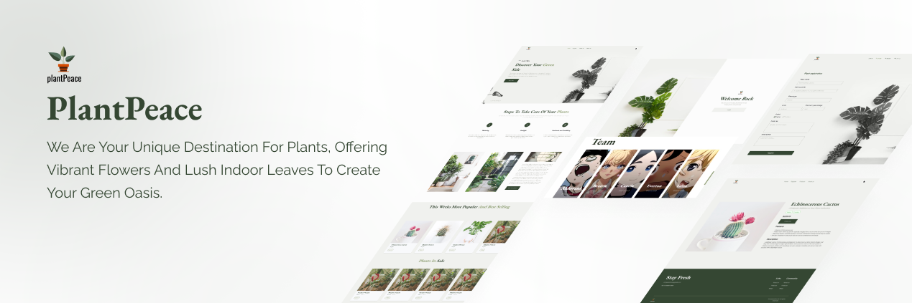

# 🌱 plantPeace
O plantPeace é um site de plantas fictícias, nele você encontra 4 páginas, home, register, products e about us, todas seguindo os designs e requisitos dados no [Notion](https://dramatic-water-ade.notion.site/Desafio-2-Semana-8-956e3babfbc04f9aa29dde186cddaba5). Sendo que, a página Home é a página inicial após o login, a página Register é onde você cadastra uma planta para aparecer como um produto no site nas páginas Home e Products e a página About Us diz um pouco sobre cada desenvolvedor do projeto. Durante a criação do site foi utilizado o [trello](https://trello.com/b/93wJ5xlD/challenge-02-pb) para melhor organização da equipe.
## Requisitos

### Os requistos OBRIGATÓRIOS eram:
- [x] Utilize TypeScript para tipagem;
- [x] Utilize Clerk, uma biblioteca para lidar com a autenticação do usuário. A documentação linkada está detalhada e fornece todas as informações necessárias para aplicar esta funcionalidade;
- [x] O ícone do perfil do usuário no componente de Header precisa ser importado do Clerk;
- [x] [React Router](https://reactrouter.com/en/main) para criação das rotas, sendo que é necessário proteger as rotas;
- [x] Crie controles deslizantes para exibição das plantas nas sessões da Home, em formato de Carrossel. Recomendação de biblioteca: [Splide](https://splidejs.com/). [Splide for React docs.](https://splidejs.com/integration/react-splide/) **Sinta-se à vontade para usar a biblioteca de sua preferência;**
- [x] [JSON Sever](https://github.com/typicode/json-server) para simular um database (abaixo contém um exemplo de como deve ficar a estrutura do JSON para as plantas);
- [x] Criar, no mínimo, um método POST e um método GET para preencher o “database” e ler as informações;
- [x] Ao preencher o formulário de registro, as plantas devem ser renderizadas em tempo real nas duas sessões de plantas da página inicial;
- [x] Caso uma planta tenha desconto, ela será renderizada na seção “Plants in Sale”. Você precisa usar a porcentagem do banco de dados JSON Server para calcular o desconto e exibir o preço final;
- [x] Os campos de formulário devem ser todos validados;
- [x] Ao clicar no cartão de uma planta, é necessário redirecionar o usuário para a rota específica que contém suas informações detalhadas (Product Page);
- [x] Você precisa criar uma página “About Us” que contenha informações sobre os desenvolvedores. Use sua imaginação para criar esta página, basta usar a mesma paleta de cores;
- [x] A aplicação deve estar responsiva;
- [x] Crie um repositório privado em seu Github e adicione os instrutores como colaboradores do projeto;
- [x] Adicione um README ao seu projeto;
- [x] Faça pequenos commits e use Convencionais Commits para manter seu repositório organizado.

### Os requisitos OPCIONAIS eram:
- [x] Aplicar efeitos de Hover;
- [x] Criar uma página (’Products’, que está na Header) para renderizar todas as plantas que estão em seu database.


## Tecnologias
* React
* TypeScript
* Tailwind CSS
* Splide
* Clerk

## Instalação
Faça o clone do projeto através do terminal de sua IDE de preferência
```bash
git clone https://github.com/Aldovani/challenge-02-pb.git .
```

No arquivo .env.example usamos a seguinte chave para o Clerk
```bash
VITE_CLERK_PUBLISHABLE_KEY=pk_test_Y2xhc3NpYy1odXNreS0xOC5jbGVyay5hY2NvdW50cy5kZXYk
```

Após instalar as dependências rode a api
```bash
npm run db
```
Após isso instale as dependências necessárias
```bash
npm install
```

Rode o comando abaixo para abrir o projeto em sua máquina
```bash
npm run dev
```

## Desenvolvedores
### [Aldovani Henrique da Costa](https://github.com/Aldovani)
### [Beatriz Zanchin Messias](https://github.com/Biazanchin)
### [Camila Marques de Paula](https://github.com/itsmecamila)
### [Everton Ceciliano De Souza](https://github.com/EvertonCeciliano)
### [Talita Berjas Favore](https://github.com/itsmecamila)
